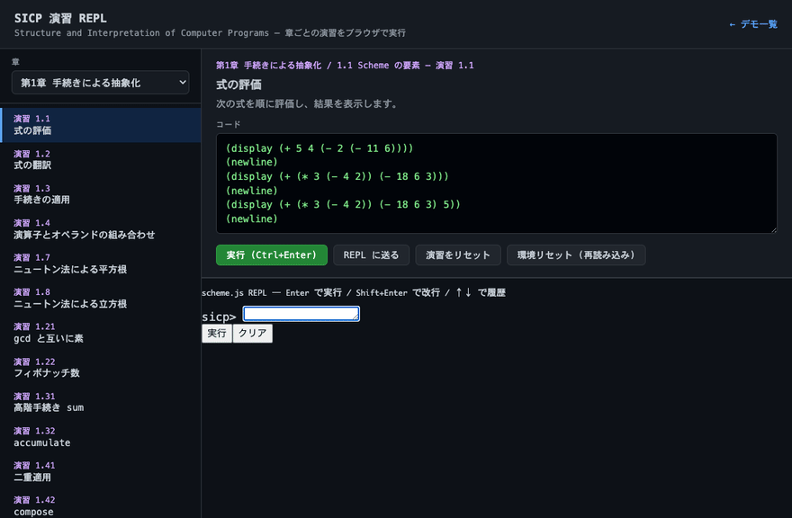

# scheme.js

JavaScript で実装した Scheme インタプリタです。

[](https://www.npmjs.com/package/@nsas454/scheme-js)

```bash
npm install @nsas454/scheme-js
```

基本的な構文に加えて、**クロージャー**・**マクロ(`define-macro`)**・**継続(`call/cc`)** に対応しています。継続は CPS(継続渡しスタイル)+ トランポリンで実装しており、捕捉した継続を変数に保存して後から何度でも呼び出せる「完全な(ファーストクラスの)継続」です。

## 特長

- 字句スコープに基づく真のクロージャー
- `define-macro` による Lisp 風マクロ(引数は未評価の S 式として渡る)
- `call/cc` / `call-with-current-continuation` によるファーストクラスの継続(再入可能・再利用可能)
- トランポリン駆動によりスタックを消費しないため、深い再帰でもオーバーフローしにくい
- ブラウザでもサーバ(Node.js)でも動作

## プロジェクト構成

```
scheme.js/
├── index.js       # npm エントリ (require('@nsas454/scheme-js'))
├── bin/scheme-js.js   # CLI
├── src/           # ソース (編集はここ)
│   ├── parser.js      字句解析・S式パース
│   ├── evaluator.js   CPS 評価器・マクロ
│   ├── env.js         環境・クロージャー
│   ├── primitives.js  組み込み手続き・I/O
│   ├── js_interop.js  JavaScript 相互運用
│   ├── debugger.js    ステップ実行・評価トレース
│   ├── numbers.js     数値タワー
│   └── runtime.js     エントリ・REPL
├── dist/          # ビルド成果物 (node scripts/build.js)
├── examples/      # サンプル .scm
├── debug.html     # ステップ実行デバッガ UI
├── sicp-repl.html # SICP 演習専用 REPL
├── sicp/          # SICP 演習カタログ (exercises.js)
├── index.html     # GitHub Pages トップ (デモへのリンク)
├── test/          # テスト (r5rs / js-interop / debugger)
└── docs/          # ドキュメント (USAGE.md, ARCHITECTURE.md)
```

詳細な使い方は **[docs/USAGE.md](docs/USAGE.md)** を参照してください。アーキテクチャは [docs/ARCHITECTURE.md](docs/ARCHITECTURE.md) です。

### ビルド

```bash
node scripts/build.js   # src/ → dist/schemInp.js
npm test                # ビルド + 全テスト
```

## 使い方

> **詳細ガイド:** [docs/USAGE.md](docs/USAGE.md) に npm / CLI / ブラウザ / REPL / JS 連携 / デバッガの操作手順をまとめています。以下はクイックリファレンスです。

### 0. npm パッケージとして使う

```bash
npm install @nsas454/scheme-js
```

```js
const {
  scheme, scheme_run, repr,
  toScheme, fromScheme,
  setGlobal, getGlobal,
  setCommandLineArguments
} = require('@nsas454/scheme-js');

console.log(scheme('(+ 1 2 3)'));           // 6
scheme_run('(display "hello\\n")');          // display 出力 + 例外時 throw

// JavaScript オブジェクトを Scheme へ渡す
setGlobal('config', { retries: 3 });
scheme('(js-ref config "retries")');        // 3

// Scheme 手続きを JavaScript 関数として使う
scheme('(define (double x) (* x 2))');
const double = fromScheme(getGlobal('double'));
double(21);                                 // 42
```

### 0b. CLI: `.scm` ファイルを実行

グローバルインストール後:

```bash
npm install -g @nsas454/scheme-js
scheme-js examples/hello.scm
scheme-js -e "(display (+ 1 2))"    # => 3
scheme-js                           # 対話 REPL
```

ローカル開発時:

```bash
node bin/scheme-js.js examples/hello.scm
```

スクリプト引数は R7RS の `(import (scheme process-context))` の `command-line` で参照できます。

### 0c. JavaScript 相互運用 (Scheme 側)

起動時に `jsdot` / `jslog` / `jsnew` マクロと `js-window` が登録されます。

#### 糖衣構文（自然な操作）

```scheme
;; プロパティ参照・メソッド呼び出し（文字列不要）
(define Math (js-ref js-window "Math"))
(jsdot Math abs -3)              ; => 3

(define o (js-object (cons "name" "scheme-js")))
(jsdot o name)                   ; => "scheme-js"

(jslog "hello" 42)               ; console.log
(jsdot! (jsnew Date 0) getFullYear)  ; 引数なしメソッド
```

#### 低レベル API

| 手続き | 説明 |
| --- | --- |
| `js-global` / `js-window` | ホストオブジェクト |
| `js-ref` / `js-set!` | プロパティ参照・代入 |
| `js-get` | プロパティチェーン `(js-get obj "a" "b")` |
| `js-call` / `js-invoke` / `js-apply` | メソッド・関数呼び出し |
| `js-new` | コンストラクタ |
| `js-object` / `js-array` | JS オブジェクト・配列を生成 |
| `js-length` / `js-typeof` / `js-in?` | 配列長・型・キー存在 |
| `js?` / `js-value?` / `js-null?` | 述語 |
| `scheme->js` / `js->scheme` | 値の変換 |

```scheme
(js-get js-window "Math" "PI")
(js-array 1 2 3)                 ; JS 配列（#<js:Array[3]>）
(js-object (cons "x" 10))        ; JS オブジェクト
```

### 0d. ステップ実行・デバッガ（学習用）

評価器にフックし、**どの式がいつ評価・適用されたか**を追跡できます。

**ブラウザ UI**: `debug.html` を開く（F10=ステップ、F5=続行）

**JavaScript API**:

```js
const { scheme_debug_start, scheme_debug_trace, scheme_trace_walker } = require('@nsas454/scheme-js');

// ステップ実行
const sess = scheme_debug_start('(+ 1 2)');
sess.start();                    // 最初の式で停止
console.log(sess.currentEvent);  // { phase: 'eval', source: '(+ 1 2)', env: [...] }
sess.step();                     // 1 式進む
sess.continue();                 // 最後まで実行

// 全トレースを記録して再生
const trace = scheme_debug_trace('(define x 5) (+ x 1)');
const w = scheme_trace_walker(trace);
w.current();  // 最初のイベント
w.next();     // 次へ
```

記録されるイベント:

| phase | 内容 |
| --- | --- |
| `eval` | 評価開始（式・型・環境スナップショット） |
| `return` | 評価完了（戻り値） |
| `apply` | 手続き適用（関数名・引数） |

### 1. ブラウザ: `<script type="text/scheme">` で実行する

**オンラインデモ:** [https://nsas454.github.io/scheme.js/](https://nsas454.github.io/scheme.js/) — デモ・REPL・**SICP 演習 REPL**・デバッガを GitHub Pages で公開しています。



`dist/schemInp.js` を読み込むと、ページ内の `<script type="text/scheme">` ブロックがページ読み込み完了時に上から順に自動実行されます。

```html
<!-- R7RS-large 拡張 (任意) -->
<script src="dist/r7rs_large.js"></script>
<!-- インタプリタ本体 -->
<script src="dist/schemInp.js"></script>

<!-- (任意) display の出力先。id="scheme-output" の要素があればそこにも出力される -->
<pre id="scheme-output"></pre>

<!-- Scheme コードを直接書く -->
<script type="text/scheme">
  (display (+ 1 2 3))
  (define (make-adder n) (lambda (x) (+ x n)))
  (display ((make-adder 5) 10))
</script>

<!-- 外部ファイルを読み込んで実行する -->
<script type="text/scheme" src="hello.scm"></script>
```

`type` は `text/scheme` のほか `text/x-scheme` / `application/scheme` / `text/lisp` も使えます。

> 注意: `src` での外部ファイル読み込みは同期 XHR を使うため、`file://` で直接開くとブラウザの CORS 制約で読めないことがあります。その場合はインライン記述を使うか、簡易 HTTP サーバ(例: `python3 -m http.server`)経由で開いてください。インラインの `<script type="text/scheme">` はサーバなしでも動作します。

動作確認用の `demo.html` を用意しています。ブラウザで開くと実行結果が表示されます。

### 2. ブラウザ: REPL UI で対話実行する

`repl.html` をブラウザで開くと、ターミナル風の REPL で Scheme を対話的に実行できます。

- **Enter** — 式を実行(括弧が閉じていなければ複数行入力に続行)
- **Shift+Enter** — 改行
- **↑ / ↓** — 入力履歴
- `define` などの定義はセッション中保持されます

```html
<script src="dist/r7rs_large.js"></script>
<script src="dist/schemInp.js"></script>
<div id="my-repl"></div>
<script>
  scheme_repl_ui(document.getElementById('my-repl'));
</script>
```

プログラムから 1 式ずつ評価する API も利用できます。

```js
var res = scheme_repl_eval('(+ 1 2)');
// res.ok === true, res.value === 3, res.output === '' (display の出力)
// res.error === null
```

> `file://` で開いても REPL は動作します(外部ファイル読み込みは不要)。

### 2b. ブラウザ: SICP 演習 REPL

[SICP](https://mitpress.mit.edu/9780262510875/structure-and-interpretation-of-computer-programs/)（計算機プログラムの構造と解釈）の演習を章ごとに選んで実行できる UI です。

- **オンライン:** [sicp-repl.html](https://nsas454.github.io/scheme.js/sicp-repl.html)
- 左サイドバーで章・演習を選択
- コードエディタで編集して **実行** または REPL に送る
- URL パラメータ `?ch=1&ex=1.7` で演習を直接開けます

```bash
# デモ GIF の再生成 (playwright + ffmpeg が必要)
node scripts/record-sicp-gif.mjs
```

### 3. ブラウザ: JavaScript の関数として実行する

`schemInp.js` を読み込むと、グローバルに `scheme()` 関数が定義されます。文字列で渡したコードを評価し、最後の式の結果を返します。

```html
<script src="dist/r7rs_large.js"></script>
<script src="dist/schemInp.js"></script>
<script>
  var result = scheme("(+ 1 2 3)"); // => 6
  console.log(result);
</script>
```

### 4. Node.js から使う

```js
const { scheme, repr } = require('@nsas454/scheme-js');
// またはローカル clone: require('./index.js')

console.log(scheme('(+ 1 2 3)'));                  // 6
console.log(scheme('(define (f x) (* x x)) (f 9)'));// 81
```

## 対応している構文・機能

### 特殊形式

| 構文 | 例 |
| --- | --- |
| `define` | `(define x 10)` / `(define (f a b) (+ a b))` |
| `lambda` | `(lambda (x) (* x x))` |
| `set!` | `(set! x 20)` |
| `if` | `(if (< a b) a b)` |
| `cond` | `(cond ((eq? a 1) 'one) (else 'other))` |
| `case` | `(case x ((1 2) 'low) (else 'other))` |
| `and` | `(and (< 0 x) (< x 10))`(短絡評価) |
| `or` | `(or (eq? x 0) (eq? x 1))`(短絡評価) |
| `let` | `(let ((a 1) (b 2)) (+ a b))` |
| 名前付き `let` | `(let loop ((i 0)) (if (= i 5) i (loop (+ i 1))))`(ループ) |
| `let*` | `(let* ((a 1) (b (+ a 1))) (+ a b))`(逐次束縛) |
| `letrec` | `(letrec ((f (lambda (n) ... (g ...))) (g ...)) (f 10))`(相互再帰) |
| `do` | `(do ((i 0 (+ i 1)) (s 0 (+ s i))) ((= i 5) s))`(反復) |
| `begin` | `(begin (display 1) (display 2))` |
| `quote` | `(quote (1 2 3))` / `'(1 2 3)` |
| `quasiquote` | `` `(x ,a ,@lst) `` / `(quasiquote ...)`(準クオート) |
| `delay` | `(delay (+ 1 2))`(遅延評価。`force` で実体化) |
| `define-macro` | `(define-macro (when t body) (list 'if t body 0))` |
| `define-syntax` / `syntax-rules` | `(define-syntax swap! (syntax-rules () ((_ a b) ...)))` |
| `let-syntax` / `letrec-syntax` | `(let-syntax ((m (syntax-rules ...))) ...)` |

### 主な組み込み手続き

R5RS の標準手続きを幅広くサポートしています。

- 算術: `+` `-` `*` `/` `abs` `min` `max` `quotient` `remainder` `modulo` `gcd` `lcm` `floor` `ceiling` `round` `truncate` `sqrt` `expt` `exp` `log` `sin` `cos` `tan` `asin` `acos` `atan`
- 数値述語/変換: `number?` `integer?` `real?` `zero?` `positive?` `negative?` `odd?` `even?` `exact?` `inexact?` `number->string` `string->number` `exact->inexact` ほか
- 比較: `=` `<` `>` `<=` `>=`
- 等価性: `eq?` `eqv?` `equal?`
- リスト: `car` `cdr` `cons` `list` `append` `length` `reverse` `list-ref` `list-tail` `member`/`memq`/`memv` `assoc`/`assq`/`assv` `caar`〜`cadddr` `set-car!` `set-cdr!` `null?` `pair?` `list?`
- 高階: `map` `for-each` `apply`
- 述語: `boolean?` `symbol?` `string?` `char?` `vector?` `procedure?` `not`
- 文字: `char->integer` `integer->char` `char=?` `char<?` … `char-ci=?` `char-ci<?` … `char-upcase` `char-downcase` `char-alphabetic?` `char-numeric?` `char-whitespace?`
- 文字列: `string?` `string-length` `string-ref` `substring` `string-append` `string->list` `list->string` `string->symbol` `symbol->string` `string=?` `string<?` … `string-ci=?` `string-ci<?` … `make-string` `string`
- ベクタ: `vector` `make-vector` `vector-ref` `vector-set!` `vector-length` `vector->list` `list->vector` `vector-fill!` `vector-copy` `vector-copy!`
- 制御: `call/cc` / `call-with-current-continuation` `values` `call-with-values` `dynamic-wind` `delay`/`force` `eval` `apply`
- 入出力: `display` `write` `newline` `write-char` `write-string` `read` `read-char` `peek-char` `read-line` `current-input-port` `current-output-port` `set-current-input-port!` `set-current-output-port!` `open-input-string` `open-output-string` `get-output-string` `call-with-output-string` `with-output-to-string` ほか
- その他: `error` `interaction-environment` `load`(Node.js のみ)
- リテラル: 真偽値 `#t` `#f`、文字 `#\a` `#\space` `#\newline` ほか

## 例

### クロージャー

```scheme
(define (make-counter)
  (let ((c 0))
    (lambda () (set! c (+ c 1)) c)))
(define cnt (make-counter))
(cnt) ; => 1
(cnt) ; => 2
```

### 条件分岐 / 束縛

```scheme
(if (< 1 2) 'yes 'no)            ; => yes

(cond ((eq? 1 2) 'a)
      ((eq? 2 2) 'b)
      (else 'c))                 ; => b

(case (+ 2 3)
  ((1 2 3) 'low)
  ((4 5 6) 'mid)
  (else 'hi))                    ; => mid

(and 1 2 3)                      ; => 3   (全て真なら最後の値)
(or (eq? 1 2) 5 6)               ; => 5   (最初の真値)

(let* ((a 1) (b (+ a 1)) (c (+ b 1)))
  (+ a b c))                     ; => 6   (後の束縛が前の束縛を参照)
```

### 反復 / 再帰

```scheme
;; 名前付き let (ループ)
(let loop ((i 1) (acc 0))
  (if (> i 10) acc (loop (+ i 1) (+ acc i)))) ; => 55

;; do ループ
(do ((i 0 (+ i 1)) (s 0 (+ s i)))
    ((= i 5) s))                              ; => 10

;; letrec (相互再帰)
(letrec ((even? (lambda (n) (if (= n 0) #t (odd? (- n 1)))))
         (odd?  (lambda (n) (if (= n 0) #f (even? (- n 1))))))
  (even? 10))                                 ; => #t
```

### 準クオート (quasiquote)

```scheme
(define a 10)
(define lst (list 2 3 4))

`(x ,a y)        ; => (x 10 y)      ,  は unquote (評価して埋め込む)
`(1 ,@lst 5)     ; => (1 2 3 4 5)   ,@ は unquote-splicing (リストを展開)
`(sum ,(+ 1 2))  ; => (sum 3)

;; マクロと組み合わせるとコード生成が簡潔に書ける
(define-macro (swap-add a b) `(+ ,a ,b))
(swap-add 3 4)   ; => 7
```

### マクロ

```scheme
;; Lisp 風マクロ (define-macro)
(define-macro (when test body)
  (list 'if test body 0))
(when (eq? 1 1) 42) ; => 42

;; パターンマッチに基づくマクロ (define-syntax / syntax-rules)
(define-syntax swap!
  (syntax-rules ()
    ((_ a b) (let ((tmp a)) (set! a b) (set! b tmp)))))
(define x 1) (define y 2)
(swap! x y) (list x y) ; => (2 1)

;; エリプシス (...) で可変長パターン
(define-syntax my-and
  (syntax-rules ()
    ((_) #t)
    ((_ e) e)
    ((_ e1 e2 ...) (if e1 (my-and e2 ...) #f))))
(my-and 1 2 3)   ; => 3

;; リテラル識別子
(define-syntax arrow
  (syntax-rules (=>)
    ((_ a => b) (+ a b))
    ((_ a b)    (* a b))))
(arrow 3 => 4)   ; => 7
```

### 数値タワー

```scheme
(* 1000000000000 1000000000000) ; => 1000000000000000000000000 (多倍長・exact)
(/ 1 3)                         ; => 1/3   (有理数)
(+ 1/3 1/6)                     ; => 1/2
(exact? 3)                      ; => #t
(inexact? 3.0)                  ; => #t
(+ 1 2.0)                       ; => 3.    (inexact が伝播)
(inexact->exact 0.5)            ; => 1/2
(sqrt 16)                       ; => 4     (完全平方数は exact)
(expt 2 -2)                     ; => 1/4
#xff                            ; => 255   (基数接頭辞)
```

### 本物のペア(cons セル)

```scheme
(cons 1 2)            ; => (1 . 2)   (ドット対)
'(1 2 . 3)            ; => (1 2 . 3) (不完全リスト)
(pair? (cons 1 2))    ; => #t
(eq? (cons 1 2) (cons 1 2)) ; => #f  (別インスタンス)

;; 破壊的変更と構造共有
(define p (cons 'x 'y))
(set-cdr! p 'z)
p                     ; => (x . z)

;; 可変長引数(ドット仮引数)
(define (sum . xs) (apply + xs))
(sum 1 2 3 4 5)       ; => 15

;; インターンされたシンボル
(eq? 'foo 'foo)       ; => #t
(symbol? 'foo)        ; => #t
```

### 複素数

```scheme
(* 3+4i 1+2i)              ; => -5+10i
(+ 1+2i 1-2i)             ; => 2        (実数へ正規化)
(/ 1+2i 1+1i)             ; => 3/2+1/2i (exact のまま)
(magnitude 3+4i)          ; => 5.
(real-part 3+4i)          ; => 3
(imag-part 3+4i)          ; => 4
(make-rectangular 3 4)    ; => 3+4i
(sqrt -1)                 ; => i
(expt +i 2)               ; => -1
(exp +i)                  ; => 0.5403+0.8415i  (オイラーの公式)
(sin (make-rectangular 1 2)) ; => 3.1658+1.9596i
(log -1)                  ; => 3.1416i (主値)
```

### 対話 REPL(Node.js)

```bash
node dist/schemInp.js
# または
node -e "require('./dist/schemInp.js').scheme_repl()"
```

```scheme
> (+ 1 2 3)
6
> (eval (read))   ; 次の行の S 式を読み込んで評価
```

パイプからの利用:

```bash
echo "(+ 1 2)" | node -e "var S=require('./dist/schemInp.js'); console.log(S.repr(S.scheme('(eval (read))')))"
; => 3
```

### I/O ポート

```scheme
;; 出力文字列ポート
(call-with-output-string
  (lambda (p) (display "x=" p) (write (+ 20 22) p))) ; => "x=42"

;; 入力文字列ポートと read
(define ip (open-input-string "(+ 1 2 3) hello"))
(eval (read ip))   ; => 6
(read ip)          ; => hello

;; read-char / read-line
(define cp (open-input-string "ab\ncd"))
(read-char cp)     ; => #\a
(read-line cp)     ; => "b"

;; ファイルポート(Node.js のみ)
(call-with-output-file "out.txt" (lambda (p) (display "hello" p)))
(call-with-input-file  "out.txt" (lambda (p) (read-line p)))  ; => "hello"
```

### 継続(call/cc)

```scheme
;; 早期脱出
(call/cc (lambda (k) (+ 1 (k 10)))) ; => 10

;; 継続を保存して後から呼び出す(再入可能)
(define saved 0)
(+ 100 (call/cc (lambda (k) (set! saved k) 1))) ; => 101
(saved 10)                                       ; => 110
```

### dynamic-wind と継続

```scheme
;; 継続による脱出時にも after / before が実行される
(begin
  (define w '())
  (call/cc
    (lambda (esc)
      (dynamic-wind
        (lambda () (set! w (cons 'in w)))
        (lambda () (esc 'done))
        (lambda () (set! w (cons 'out w))))))
  w)   ; => (out in)
```

### リーダ拡張・内部 define

```scheme
(+ 1 #|コメント|# 2)        ; => 3
(+ 1 #;(+ 99) 2)            ; => 3  (#; の次の datum を無視)

((lambda () (define x 10) (+ x 5)))  ; => 15  (内部 define → letrec 変換)
```

### R7RS ライブラリ・拡張構文

```scheme
;; ライブラリ定義と import
(define-library (mylib)
  (export double)
  (import (scheme base))
  (begin (define (double x) (* x 2))))
(import (mylib))
(double 10)   ; => 20

;; case-lambda
((case-lambda (() 'none) ((x) x)))       ; => none
((case-lambda (() 'none) ((x) x)) 42)   ; => 42

;; define-values / let-values
(define-values (a b) (values 1 2))
(let-values (((x y) (values 3 4))) (+ x y))  ; => 7

;; guard / raise
(guard (e (#t 'ok)) (raise 'err))   ; => ok

;; define-record-type
(define-record-type point
  (make-point x y)
  point?
  (x point-x)
  (y point-y point-y-set!))

;; ハッシュテーブル
(define ht (make-hash-table))
(hash-table-set! ht 'key 42)

;; cond-expand
(cond-expand (r7rs 'yes) (else 'no))  ; => yes

;; (scheme list) ライブラリ
(import (scheme list))
(filter (lambda (x) (> x 1)) '(1 2 3))  ; => (2 3)
```

## R5RS 対応状況

R5RS の機能を段階的に取り込んでいます。多くの標準手続き・特殊形式・データ型(文字・文字列・ベクタ・真偽値)に対応済みですが、以下はまだ未対応/簡易対応です。

対応済み:

- **マクロ `define-syntax` / `syntax-rules`**(リテラル・エリプシス `...`・入れ子パターン・`let-syntax`/`letrec-syntax` に対応)
- **数値タワー**(`exact` な多倍長整数 / 有理数、`inexact` な浮動小数、**複素数**。`exact?`/`inexact?`/`exact->inexact`/`inexact->exact`、有理数演算、基数接頭辞 `#x`/`#o`/`#b`/`#d`、正確さ接頭辞 `#e`/`#i`、`#e1.5 → 3/2` など)
- **複素数**(`3+4i` / `+i` / `2i` などのリテラル、`make-rectangular`/`make-polar`/`real-part`/`imag-part`/`magnitude`/`angle`、四則演算、`(sqrt -1) → i`、超越関数 `exp`/`log`/`sin`/`cos`/`tan`/`asin`/`acos`/`atan`/`expt` の複素数引数)
- **I/O ポート**(文字列ポート `open-input-string`/`open-output-string`/`get-output-string`、`read`/`read-char`/`peek-char`/`read-line`、`call-with-output-string`/`with-output-to-string`、`display`/`write`/`newline` 等のポート引数。ファイルポート `open-input-file`/`open-output-file`/`call-with-input-file`/`call-with-output-file`/`with-output-to-file`/`with-input-from-file` は **Node.js のみ**)
- **対話的 stdin(Node.js)**。既定の入力ポートが標準入力に接続され、`(read)` / `(read-line)` / `(eval (read))` が利用可能。`node dist/schemInp.js` または `scheme_repl()` で REPL 起動
- **ブラウザ REPL UI**(`repl.html` / `scheme_repl_ui()` / `scheme_repl_eval()`)。ターミナル風の対話実行、履歴、複数行入力
- **本物のペア(cons セル)**。実行時のリストデータは本物の `Pair`(cons セル)で表現し、空リストは `'()`(= `null`)。ドット対 `(a . b)` / 不完全リスト `(a b . c)` の読み取り・表示、`set-car!`/`set-cdr!` による破壊的変更と構造共有、`eq?` によるペアの同一性、循環リストに安全な `list?`/表示、可変長引数 `(lambda args ...)` / `(define (f a . rest) ...)` に対応
- **シンボルのインターン化**(`(eq? 'a 'a)` ・ `(symbol? 'a)` が正しく動作)
- **リーダコメント**(`;` 行コメント、`#| ... |#` ブロックコメント、`#;datum` データコメント)
- **`syntax-rules` の衛生性**(テンプレート導入束縛の gensym、マクロ定義環境の自由変数の `macro-capture` 保持)
- **`dynamic-wind` の継続対応**(継続の脱出/再入時に `before`/`after` を wind スタック転送で実行)
- **内部 `define` の R5RS 準拠**(`lambda`/`begin`/`letrec` 本体を `letrec` 脱糖)
- **追加標準手続き**(`load`[Node.js]、`string-ci=*`、`char-ci=*`、`vector-copy`/`vector-copy!`、`set-current-input-port!`/`set-current-output-port!`)

簡易対応:

- 複素数の `log`/`asin`/`acos`/`atan` は**主値**(principal value)を返します。`(log -1)` は `i*pi` 相当です。
- 対話的 stdin は **Node.js のみ**(ブラウザでは stdin なし = EOF)。TTY では `char-ready?` は常に `#t` になり得ます(ブロック読み取り)。
- 内部の AST(コード)は JavaScript 配列のままで、`quote`/`quasiquote`/`eval` の境界で配列↔ペアを相互変換しています(ユーザが操作するリストデータは常に本物の cons セル)。

備考:

- 末尾呼び出しはトランポリン + CPS により実質的にスタック安全(末尾位置の再帰は定数スタック)です。

## R7RS 対応状況

R7RS small の主要機能と、large の一部ライブラリに対応しています。

対応済み (R7RS small):

- **`define-library` / `import` / `export`** — ライブラリ定義と名前付き import(`only:` / `except:` 修飾子)
- **組み込みライブラリ** — `(scheme base)` `(scheme case-lambda)` `(scheme hash-table)` `(scheme list)`
- **`case-lambda`** — 引数個数別の手続き定義
- **`define-values` / `let-values` / `let*-values`**
- **`cond-expand`** — 機能識別子 `scheme` `r7rs` `r5rs` `scheme-js` `node` `unix` `windows`
- **`include` / `include-ci`** — ファイル取り込み(Node.js のみ)
- **`guard` / `raise`** — 例外処理(条件オブジェクト)
- **`define-record-type`** — レコード型(コンストラクタ・述語・アクセサ・mutator)
- **`cond` の `=>` 節** — `(test => proc)` 形式

対応済み (R7RS large — Red Edition 中心):

`src/r7rs_large.js` が Node.js では自動ロード、ブラウザでは `dist/r7rs_large.js` を `dist/schemInp.js` より先に読み込んでください。

| ライブラリ | 主な手続き |
| --- | --- |
| `(scheme bytevector)` | `make-bytevector` `bytevector-u8-ref/set!` `utf8->string` `string->utf8` 等 |
| `(scheme unicode)` | `string-normalize-nfd/nfc/nfkd/nfkc` `string-foldcase` `string-titlecase` 等 |
| `(scheme string)` | `string-map` `string-for-each` `string-index` `string-skip` `string-count` 等 |
| `(scheme vector)` | `vector-map` `vector-for-each` `vector-append` `vector->string` 等 |
| `(scheme list)` | SRFI 1 拡張: `take` `drop` `remove` `partition` `reduce` `list-tabulate` 等 |
| `(scheme hash-table)` | SRFI 125 拡張: `hash-table-size` `hash-table-clear!` `hash-table-update!` 等 |
| `(scheme sort)` | `list-sort` `vector-sort` `sorted?` |
| `(scheme division)` | `div` `mod` `div-and-mod` `div0` `mod0` `exact-integer-sqrt` |
| `(scheme inexact)` | `finite?` `infinite?` `nan?` `+nan.0` `+inf.0` `-inf.0` |
| `(scheme random)` | `random-integer` `random-real` `random-sample` |
| `(scheme process-context)` | `command-line` `get-environment-variable` `exit` |
| `(scheme time)` | `current-second` `jiffies` |
| `(scheme box)` | `box` `unbox` `set-box!` |
| `(scheme generator)` | `make-iota-generator` `g-collect` `g-for-each` 等 |
| `(scheme stream)` | `stream-cons` `stream-car/cdr` `stream-null?` 等 |
| `(scheme text)` | SRFI 135 抜粋: `string->text` `text->string` `text-ref` 等 |
| `(scheme write)` | `write-simple` + 既存 write/display |
| `(scheme char)` `(scheme cxr)` `(scheme complex)` `(scheme eval)` `(scheme read)` `(scheme file)` `(scheme lazy)` `(scheme load)` | 既存手続きの再 export |
| `(scheme red)` | 上記 Red Edition ライブラリの統合 import |

未対応 / 簡易対応:

- `(scheme ilist)` `(scheme rlist)` `(scheme ideque)` `(scheme set)` `(scheme charset)` `(scheme comparator)` 等の Red Edition 残ライブラリ
- `string-fill!` / `string-set!` — JavaScript 文字列は不変のため完全な破壊的操作には非対応
- `#u8(...)` リテラル読み取り(手続きによる生成は可)
- `identifier-syntax` / `er-macro-transformer` 等の低レベルマクロ

テスト:

```bash
node scripts/build.js
node test/r5rs/test_r7rs.js
node test/r5rs/test_r7rs_large.js
node test/r5rs/test_r5rs_extra.js
```

## npm への公開（メンテナ向け）

`@nsas454/scheme-js` は npm レジストリ向けに設定済みです（グローバル名 `scheme-js` は既存パッケージと類似のためスコープ付き）。初回公開手順:

```bash
npm login                    # npmjs.com アカウントでログイン
npm test                     # テスト + ビルド
npm publish --access public  # prepublishOnly で再度テスト実行
```

GitHub Actions から公開する場合は、リポジトリ Secrets に `NPM_TOKEN`（npm の Automation トークン）を登録し、GitHub Release を publish するか、Actions の **Publish npm package** ワークフローを手動実行します。

```bash
# バージョン更新例
npm version patch   # package.json の version を上げて git tag 作成
git push && git push --tags
# GitHub で Release を作成 → 自動 publish
```

## ライセンス

MIT License. Copyright (c) 2014 Shuichi Yukimoto.
